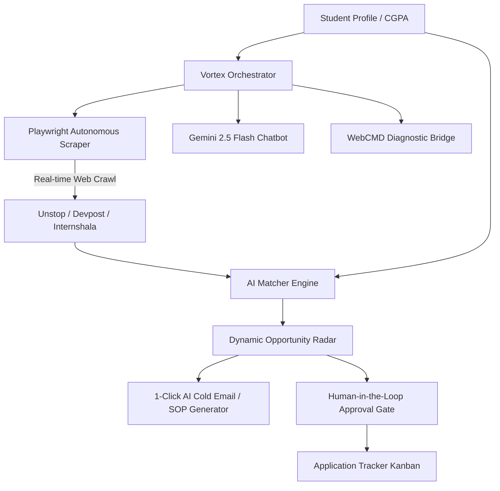

# ⚡ VORTEX — Autonomous Student Life & Opportunity Agent

> **Built for Hackathons** | An intelligent agent that autonomously discovers live student opportunities, calculates multi-factor compatibility (Skills + CGPA), generates 1-click tailored application collateral, and provides a real-time Gemini-powered strategic advisor.

[](https://nodejs.org)
[](https://react.dev)
[](https://ai.google.dev/)
[](https://playwright.dev/)
[](https://github.com)

---

## 🎯 The Problem
University students miss out on career-defining hackathons, high-value scholarships, and internships because:
1. **Information Fragmentation:** Opportunities are scattered across Unstop, Devpost, Internshala, and corporate portals.
2. **Eligibility & CGPA Blindspots:** Students apply to programs where their CGPA or skills don't qualify.
3. **Application Fatigue:** Writing customized cold emails and cover letters for dozens of portals is tedious and time-consuming.

---

## 💡 The Solution: Vortex Agent
**Vortex** is an autonomous agent with a full multi-modal workflow:
- 🌐 **Real-time Autonomous Web Crawling:** Headless browser scraping via Playwright across Unstop, Devpost, Internshala, and Google with zero static mocked data.
- 🎯 **Skill & CGPA-Aware Matchmaking:** Computes a transparent 0–99% compatibility score factoring in tech stack coverage and strict academic eligibility cutoffs.
- 🤖 **Gemini AI Strategic Assistant:** Built-in floating Gemini chatbot that answers questions about hackathon winning playbooks, scholarship SOPs, and role preparation.
- ⚡ **1-Click Application Collateral Generator:** Instantly drafts targeted cold emails and personalized cover letters matched to the student's profile and company mission.
- 🛡️ **Human-in-the-Loop Approval Gate:** Every automated submission flow requires explicit student confirmation before taking action.
- 🖥️ **WebCMD Infrastructure Console:** Live diagnostic console monitoring headless browser sessions, memory, and automated tasks.

---

## 🏗️ Architecture Overview



---

## 🚀 Quickstart (Hackathon Demo)

### 1. Prerequisites
- Node.js 18+ installed

### 2. Environment Setup
The project includes a `.env` file configured with your Gemini API Key:
```env
PORT=3001

```

### 3. Running the Application
Open **two terminals**:

#### Terminal 1: Backend Server (Port 3001)
```bash
node server/index.js
```
*Expected log output:*
```text
🚀 Vortex Student Life Agent Server running on http://localhost:3001
[WebCMD SUCCESS] Server listening on port 3001. Playwright Live Web Scraper ready.
```

#### Terminal 2: Frontend Web App (Port 5173)
```bash
npm run dev
```
*Expected log output:*
```text
  VITE v8.3.0  ready in 350 ms
  ➜  Local:   http://localhost:5173/
```

Open **[http://localhost:5173](http://localhost:5173)** in your browser!

---

## 🎬 Hackathon Pitch & Demo Walkthrough

### ⏱️ 3-Minute Demo Flow for Judges:

1. **Futuristic Startup Experience (0:00 - 0:20)**
   - Open [http://localhost:5173](http://localhost:5173).
   - Point out the glowing entrance animation, dynamic theme, and particle splash screen.

2. **Student Profile & CGPA Input (0:20 - 0:50)**
   - Enter a student profile:
     - **Name:** Shubham Singh
     - **University:** VIT Bhopal
     - **Skills:** `Python, React, Node.js, AI & ML, Data Structures`
     - **CGPA:** `8.5/10`
   - Click **Save Profile & Start Tracking**.

3. **Autonomous Live Web Crawling (0:50 - 1:30)**
   - Switch to the **WebCMD Console** tab to show judges the Playwright engine actively querying live internet endpoints (Unstop, Devpost, Internshala).
   - Return to the **Opportunity Radar** tab: Cards display real-time titles, accurate deadlines, prize stipends, and dynamically calculated match percentages.

4. **Gemini AI Strategic Chatbot (1:30 - 2:15)**
   - Click the floating **Gemini Chatbot** bubble in the bottom right corner.
   - Ask: *"What hackathons do you recommend for my profile and how should we structure our 3-minute pitch?"*
   - Highlight how Gemini uses the student's active skills and loaded opportunities to formulate its response.

5. **1-Click AI Application & Human Gate (2:15 - 3:00)**
   - Click **"Generate AI Content"** on a top match card.
   - Demonstrate the generated recruiter cold email and tailored cover letter.
   - Click **"Prepare Application"** to demonstrate the **Human-in-the-Loop Approval Modal** before entries transition to the **Application Tracker Board**.

---

## 🛠️ Technology Stack

| Layer | Technology |
|---|---|
| **Frontend UI** | React 19, Vite, Lucide Icons, Glassmorphism CSS Design System |
| **Backend API** | Node.js, Express 5, CORS, Dotenv |
| **Agent / LLM** | Google Gemini (`@google/genai`), Intelligent Context Engine |
| **Browser Scraping** | Playwright (Headless Chromium) |
| **Diagnostics** | @agentrhq/webcmd |

---

## 👥 Team
- **Vortex Team** — Developed with Google Gemini & Antigravity IDE
